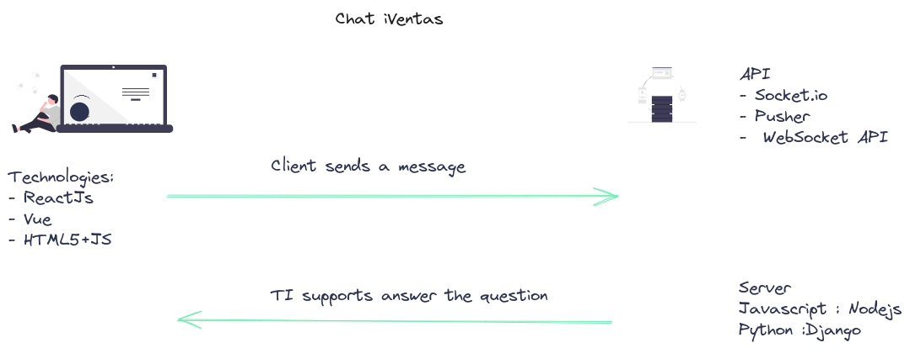

# Chat iVentas

Link: [Link to this doc](#)

Author(s): Erika F.

Status: [Draft]

Last Updated : 2023-07-20

## Contents

- Goals
- Non-Goals
- Background
- Overview
- Detailed Design
    - Solution 1
        - Frontend
        - Backend
    - Solution 2
        - Frontend
        - Backend
- Considerations
- Metrics

## Objective

_What and why are we doing this?_

A web application that allows real-time communication between client and server.

It's a technical challenge for iVentas. The goal is to create a frontend application where we can send messages to the server and respond to them.

## Goals

- Create a front end web app where we can send the message
- Create the backend app to manage the incoming requests

## Non-Goals

- N/A

## Background

In iVentas it's a need the communication in real-time with the clients. That way we need 
to create a chat that allows us the communication between the client and our TI support.

## Overview

We need an API to allow us open a conection with the client, listen the incomming messages in
the server side, save the message in the data base, send a message back to the client.

We need to use an API that helps us in the development stage. Out there are several APIS who could help us such as 

 - [Socket.IO](https://socket.io/docs/v4/)
 - [WebSocket API](https://developer.mozilla.org/en-US/docs/Web/API/WebSockets_API)
 - [Pusher](https://pusher.com/docs/channels/server_api/overview/?ref=docs-index)

_High-level overview of your proposal_

You could find more detailed docs. 

- Frontend.
    [ChatVentas](./front/README.md)

- Backend.
    [API](./back/README.md)

## Detailed Design 

## Solution 1
FrontEnd
_Frontend_
Backend
_Backend_

## Solution 2
FrontEnd
_Frontend_
Backend
_Backend_

## Consideraciones
_Preocupaciones / trade-offs / tech debt_

## Métricas 
_Que información necesitas para validar antes de lanzar este feature_
