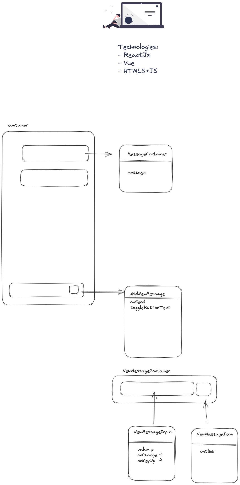

# Chat front

status :

last update: 14- jun- 2023

author : Erika Flores
<hr/>

## Docs


1. [design doc](/chat-front/src/assets/docs/README.md)


## System Requirements

- [git][git] v2.13 or greater
- [NodeJS][node] `>=16`
- [npm][npm] v8.16.0 or greater

All of these must be available in your `PATH`. To verify things are set up
properly, you can run this:

```shell
git --version
node --version
npm --version
```
If you have trouble with any of these, learn more about the PATH environment
variable and how to fix it here for [windows][win-path] or
[mac/linux][mac-path].

## Demo

Hosted on [link](#)


## Setup

> If you want to commit and push your work as you go,
> first clone this repo.


After you've made sure to have the correct things (and versions) installed, you
should be able to just run a few commands to get set up:

```
git clone 
cd bookshelf
npm run install
```
### Prepare enviroment variables

For sensitive information, which we don't want them checked into git, we inject these configurations to the application as environment variables (even for local environment). Note: we'll likely improve this process in the future.

There's a script that will help you set up the correct environment variables.

1. Copy `.env-example` file and rename into `.env` file. The file `.env` is included in `.gitignore` so the sensitive will not be checked in.

   ```bash
   $ cp .env-example .env
   ```

2. Get the actual values and paste them in `.env`.
   (ask for this file if it's your first time setting this up)

   The `env` file is not a shell execution script, but a shell configuration file. Running the command `source` loads into your **current shell session** with the appropriate environment variables instead of forking another shell session. Once you have this set, launch your IDE or text editor from the shell where the environment variables are set.

## Running the app

To get the app up and running (and really see if it worked), run:

```shell
npm start
```

This may take a few minutes.

## Expanding the ESLint configuration

If you are developing a production application, we recommend updating the configuration to enable type aware lint rules:

- Configure the top-level `parserOptions` property like this:

```js
   parserOptions: {
    ecmaVersion: 'latest',
    sourceType: 'module',
    project: ['./tsconfig.json', './tsconfig.node.json'],
    tsconfigRootDir: __dirname,
   },
```

- Replace `plugin:@typescript-eslint/recommended` to `plugin:@typescript-eslint/recommended-type-checked` or `plugin:@typescript-eslint/strict-type-checked`
- Optionally add `plugin:@typescript-eslint/stylistic-type-checked`
- Install [eslint-plugin-react](https://github.com/jsx-eslint/eslint-plugin-react) and add `plugin:react/recommended` & `plugin:react/jsx-runtime` to the `extends` list
